# Отчет по домашнему заданию 2 "Производительность индексов"

#### Table of contents

1. [Создание тестовых данных](#test-data)
2. [Подготовка к нагрузочному тестированию](#prepare)
3. [Нагрузочное тестирование до создания индекса](#perf-test-before)
    - [1 поток](#perf-test-before-1)
    - [10 потоков](#perf-test-before-10)
    - [100 потоков](#perf-test-before-100)
    - [1000 потоков](#perf-test-before-1000)
4. [Создание индекса](#index-creation)
5. [Нагрузочное тестирование после создания индекса](#perf-test-after)
    - [1 поток](#perf-test-after-1)
    - [10 потоков](#perf-test-after-10)
    - [100 потоков](#perf-test-after-100)
    - [1000 потоков](#perf-test-after-1000)
6. [Итоговая таблица](#result-table)
7. [Дополнительная информация](#info)

<a id="test-data"></a>
## Создание тестовых данных
Беру список аккаунтов из csv-фалла.

В jmeter создаю csv-data-set, создаю http-запрос на ручку регистрации, создаю thread-group на 100 потоков 10 000 итераций.

Запускаю, жду, создаются миллион аккаунтов.

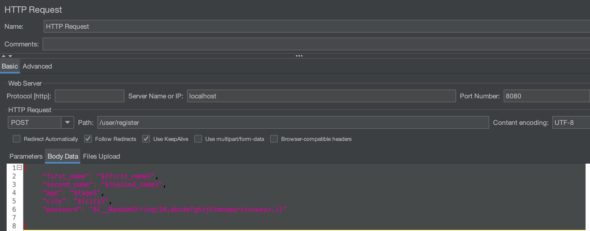
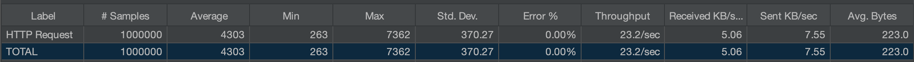


<a id="prepare"></a>
## Подготовка к нагрузочному тестированию

Устанавливаю connection pool size приложения равным 150

Статистику мониторю с помощью graphana + prometheus + micrometer

Тестирование провожу с помощью jmeter

Тесты гоняю примерно по 15 минут для каждого кейса

Передаю для поиска случайные строки длинной от 1 до 5 символов из букв русского алфавита

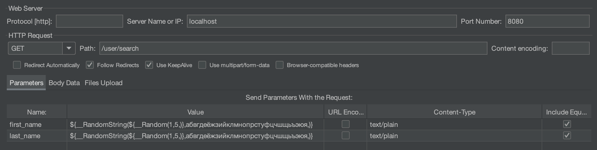


<a id="perf-test-before"></a>
## Нагрузочное тестирование до создания индекса

<a id="perf-test-before-1"></a>
### 1 поток (пользователь)

Запросы выполняются примерно за 1 секунду

Приложение обрабатывает примерно 1 запрос в секунду

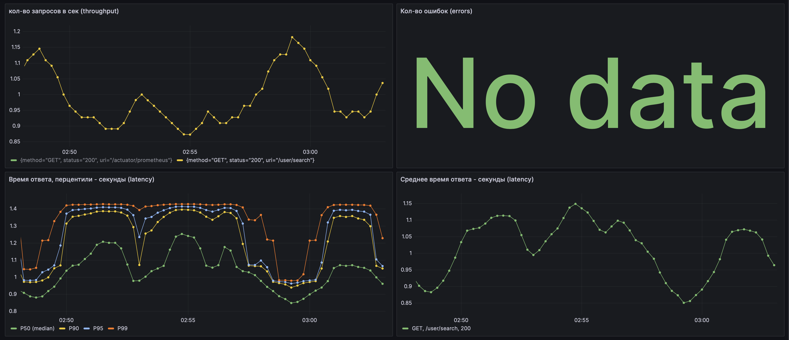

<a id="perf-test-before-10"></a>
### 10 потоков (пользователей)

Запросы выполняются примерно за 2-3 секунды

Приложение может обработать около 4-ех запросов в секунду

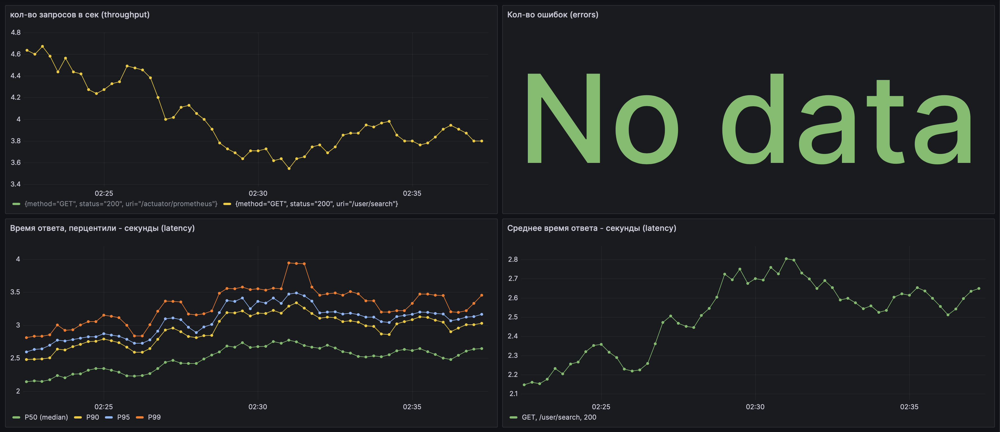

<a id="perf-test-before-100"></a>
### 100 потоков (пользователей)

Запросы выполняются примерно по 30-40 секунд

Приложение может обработать примерно 2-3 запроса в секунду

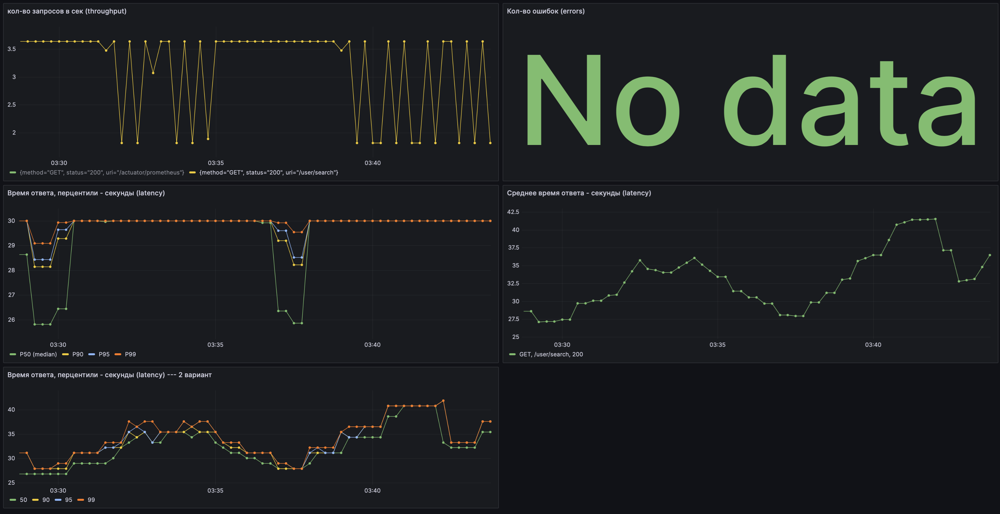

<a id="perf-test-before-1000"></a>
### 1000 потоков (пользователей)

Запросы выполняются в среднем по 190 секунд

Приложение может обработать примерно 5 запросов в секунду.

42% запросов завершается с ошибкой. Не хватает коннектов в пуле, и запросы отваливаются, так как не дождались коннекта к БД.

Графана с прометеметеусом отвалились. Прометеус не может больше делать скрапинг метрик, потому что слишком долго выполняются запросы и отваливаются по таймауту.

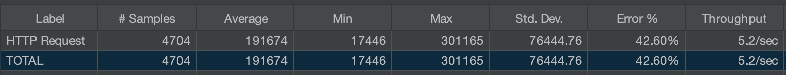
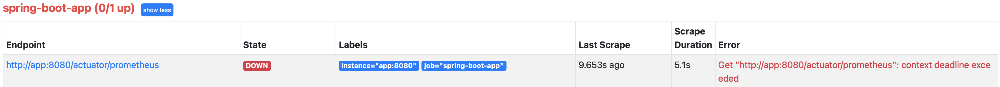


<a id="index-creation"></a>
## Создание индекса

План запроса до создания индекса:
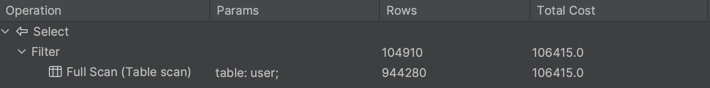

Создаём составной btree индекс с полями first_name и second_name. У нас запрос на поиск с AND по этим двум полям.
Поэтому создаём составной индекс, поля в индексе должны идти в том же порядке, что и в запросе, то есть сначала first_name, потом second_name. Ищем только по префиксу, поэтому подойдёт стандартный btree индекс.

```sql
create index ix_first_second_names on user (first_name, second_name);
```

План запроса после создания индекса:
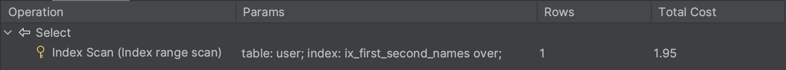


<a id="perf-test-after"></a>
## Нагрузочное тестирование полсе создания индекса

<a id="perf-test-after-1"></a>
### 1 поток (пользователь)

Запросы выполняются в среднем за 40 мс. В 90-ом перцентиле до 10 мс.

Приложение обрабатывает до 30 запросов в секунду

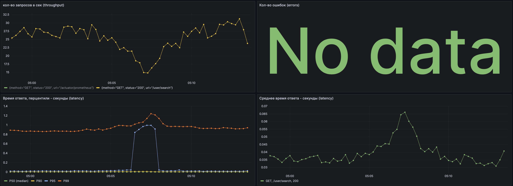

<a id="perf-test-after-10"></a>
### 10 потоков (пользователей)

Запросы выполняются в среднем за 140 мс. В 90-ом перцентиле до 30 мс.

Приложение обрабатывает до 90 запросов в секунду


<a id="perf-test-after-100"></a>
### 100 потоков (пользователей)

Запросы выполняются в среднем за 1.3 сек. В 90-ом перцентиле до 500 мс.

Приложение обрабатывает до 90 запросов в секунду

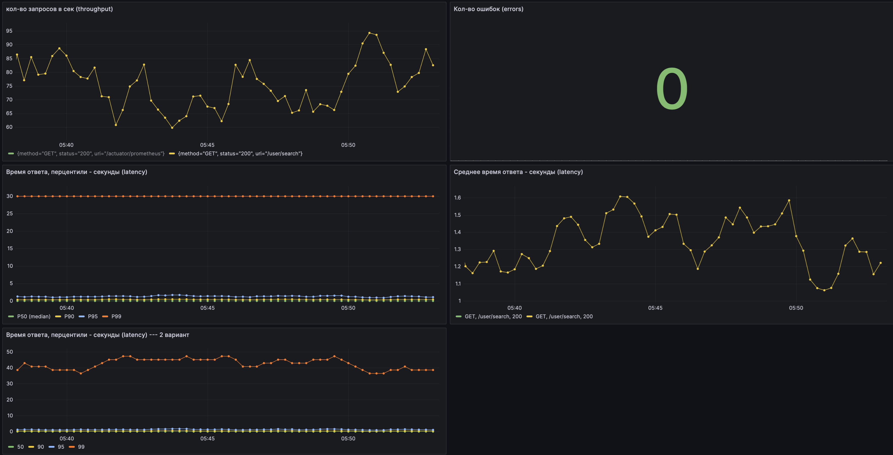

<a id="perf-test-after-1000"></a>
### 1000 потоков (пользователей)

Запросы выполняются в среднем за 12 секунд.

Приложение обрабатывает до 90 запросов в секунду

Графана с прометеметеусом отвалились. Прометеус не может больше делать скрапинг метрик, потому что слишком долго выполняются запросы и отваливаются по таймауту.

1.5% запросов завершилось с ошибкой

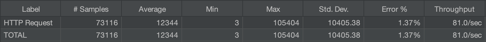


<a id="result-table"></a>
## Итоговая таблица
<table class="tg">
<thead>
  <tr>
    <th class="tg-fymr" rowspan="2">Кол-во потоков</th>
    <th class="tg-fymr" colspan="2">До создания индекса</th>
    <th class="tg-fymr" colspan="2">После создания индекса</th>
  </tr>
  <tr>
    <th class="tg-fymr">latency <br> (среднее, мс)</th>
    <th class="tg-fymr">thoughput  <br>(кол-во запросов  в сек)</th>
    <th class="tg-fymr">latency  <br>(среднее, ms)</th>
    <th class="tg-fymr">thoughput  <br>(кол-во запросов  в секунду)</th>
  </tr>
</thead>
<tbody>
  <tr>
    <td class="tg-0pky">1</td>
    <td class="tg-0pky">1000</td>
    <td class="tg-0pky">1</td>
    <td class="tg-0pky">40</td>
    <td class="tg-0pky">25</td>
  </tr>
  <tr>
    <td class="tg-0pky">10</td>
    <td class="tg-0pky">2600</td>
    <td class="tg-0pky">4</td>
    <td class="tg-0pky">120</td>
    <td class="tg-0pky">70</td>
  </tr>
  <tr>
    <td class="tg-0pky">100</td>
    <td class="tg-0pky">35000</td>
    <td class="tg-0pky">3</td>
    <td class="tg-0pky">1300</td>
    <td class="tg-0pky">90</td>
  </tr>
  <tr>
    <td class="tg-0pky">1000</td>
    <td class="tg-0pky">190000</td>
    <td class="tg-0pky">5</td>
    <td class="tg-0pky">12000</td>
    <td class="tg-0pky">90</td>
  </tr>
</tbody>
</table>


<a id="info"></a>
## Дополнительная информация
- Запрос в prometheus: кол-во запросов в сек (throughput)
```
sum by(method, uri, status) (rate(http_server_requests_seconds_count{status="200"}[$__rate_interval]))
```

- Запрос в prometheus: Кол-во ошибок (errors)
```
rate(http_server_requests_seconds_count{error!="none"}[$__rate_interval])
```

- Запрос в prometheus: Среднее время ответа - секунды (latency)
```
rate(http_server_requests_seconds_sum{uri="/user/search"}[ $__rate_interval]) 
/ 
rate(http_server_requests_seconds_count{uri="/user/search"}[$__rate_interval])
```

- Запрос в prometheus: Время ответа, перцентили - секунды (latency) - вариант 1: расчет по бакетам с помощью функции histogram_quantile прометеуса
```
histogram_quantile(0.5, sum(rate(http_server_requests_seconds_bucket{uri="/user/search"}[$__rate_interval])) by (le))
```

- Запрос в prometheus: Время ответа, перцентили - секунды (latency) - вариант 2: расчет на стороне приложения
```
max(http_server_requests_seconds{quantile="0.5", uri="/user/search"})
```
