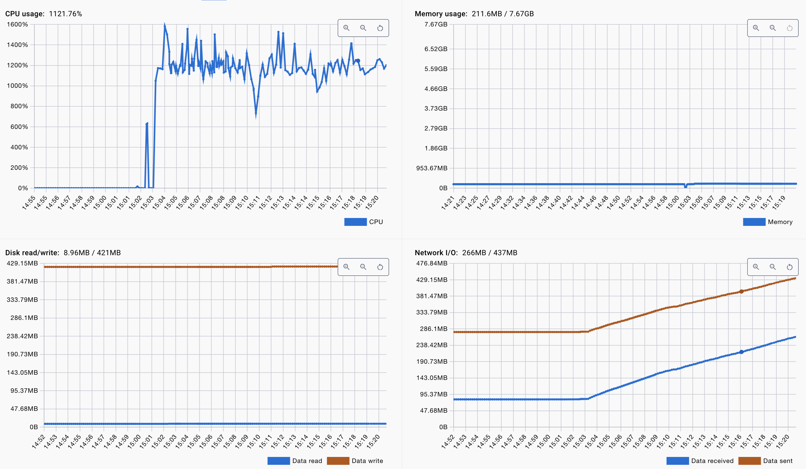
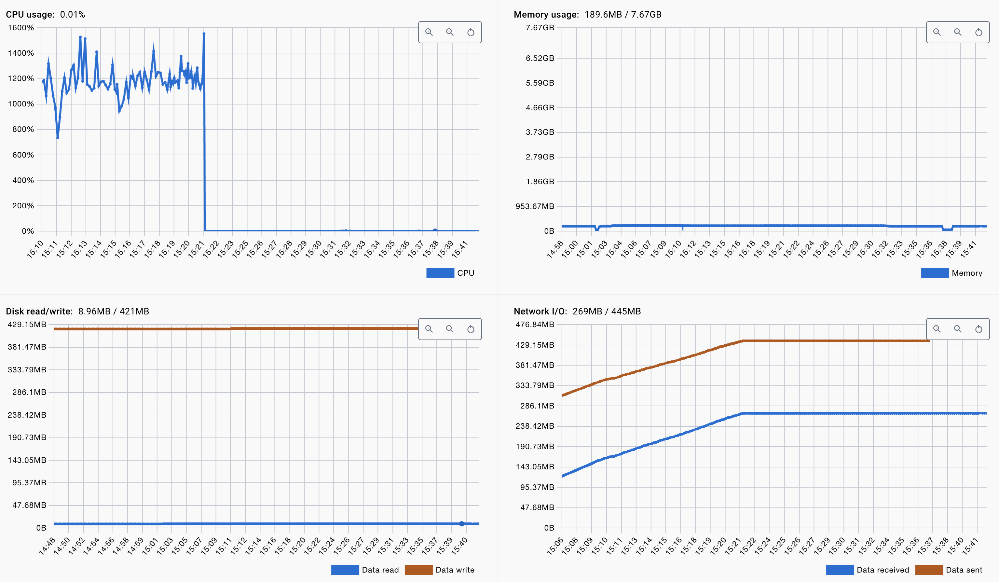
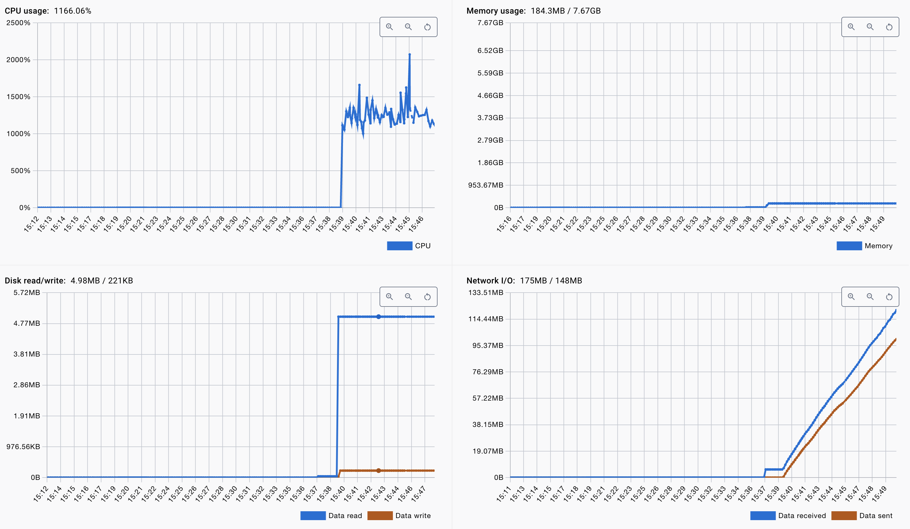
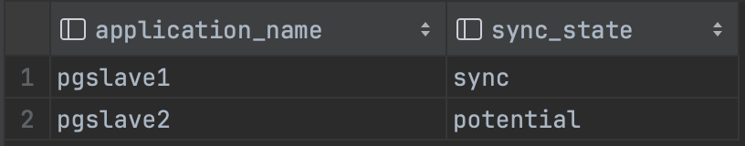
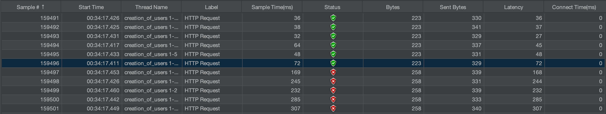
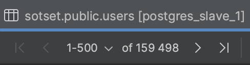
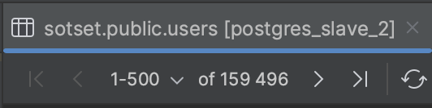

# Отчет по домашнему заданию 3 "Репликация: практическое применение"

#### Table of contents

1. [Настраиваем асинхронную репликацию](#async-repl)
   - [Настройка мастера](#async-repl-master)
   - [Настройка слейва](#async-repl-slave)
2. [Переносим чтение на слейв](#read-slave)
3. [Нагрузочное тестирование](#perf-test)
   - [Без репликации](#perf-test-before)
   - [С репликацией](#perf-test-after)
4. [Настройка синхронной репликации](#sync-repl)
5. [Эксперимент по аварийной остановке master](#experiment)


<a id="async-repl"></a>
## Настраиваем асинхронную репликацию

Цель настроить окружение с помощью [docker-compose.yml](..%2F..%2F_docker%2Fdocker-compose.yml), чтобы одной кнопкой (или командой) можно было всё поднять без дополнительных действий и необходимости лезть внутрь контейнеров для их настройки.


<a id="async-repl-master"></a>
### Настройка мастера

Добавляем postgresql мастер-ноду в docker-compose.yml
```yaml
  postgres-master:
    image: postgres
    restart: unless-stopped
    environment:
      POSTGRES_USER: postgres
      POSTGRES_PASSWORD: password
      POSTGRES_DB: sotset
    command: |
      postgres 
      -c wal_level=replica 
      -c max_wal_senders=10 
      -c hba_file=/etc/postgresql/pg_hba.conf
    ports:
      - "5432:5432"
    volumes:
      - ./postgres/master_pg_hba.conf:/etc/postgresql/pg_hba.conf
      - ./postgres/db-init:/docker-entrypoint-initdb.d/
```
Здесь:
 - В секции environment задаём переменные окружения:
   - **POSTGRES_USER** - имя пользователя бд, который создастся при старте контейнера.
   - **POSTGRES_PASSWORD** - пароль для пользователя БД
   - **POSTGRES_DB** - имя БД, которая создастся при старте контейнера.
 - В секции command указываем команду для запуска postgres и передаём некоторые свойства конфигурации. Эти параметры конфигурации можно было бы передать также через файл **postgresql.conf**, но в моём случае меньше гемора через аргументы команды запуска.
   - **wal_level** - какие данные будут записываться в "журнал предзаписи (WAL)" для репликации. При значении **replica** в журнал будут записываться данные, необходимые для бинарной (нелогической) репликации.
   - **max_wal_senders** - максимальное число одновременных подключений ведомых серверов, т.е. максимальное кол-во реплик
   - **hba_file** - путь к файлу конфигурации host-based authentication (hba). Нам нужно будет добавить в этот файл доступ для реплик. По умолчанию, этот файл лежит в папке `/var/lib/postgresql/data`. Но мы не сможем подложить этот файл в папку по умолчанию, так как эта папка при старте контейнера должна быть пустой, чтобы postgres записал туда свои данные при инициализации.
 - В секции volumes пропишем маппинг файлов и папок в локальной файловой системе на файловую систему контейнеров.
   - [./postgres/master_pg_hba.conf](..%2F..%2F_docker%2Fpostgres%2Fmaster_pg_hba.conf) файл hba с необходимой мне конфигурацией. Обязательно мапится на путь, который мы указали в параметре запуска `hba_file`.
   - [./postgres/db-init](..%2F..%2F_docker%2Fpostgres%2Fdb-init) содержит SQL-скрипты, которые будут выполнены при старте контейнера. Мапится на `/docker-entrypoint-initdb.d/`


Создадим пользователя для репликации на мастер-ноде. В папку с SQL-скриптами [./postgres/db-init](..%2F..%2F_docker%2Fpostgres%2Fdb-init) добавим файл [replication-user.sql](..%2F..%2F_docker%2Fpostgres%2Fdb-init%2Freplication-user.sql) со следующим кодом:
```postgresql
CREATE USER replicator WITH REPLICATION ENCRYPTED PASSWORD 'replicator_password';
```
Этот код создаст пользователя с именем *replicator* и паролем *replicator_password* и с правами для репликации.


Добавим доступ в [master_pg_hba.conf](..%2F..%2F_docker%2Fpostgres%2Fmaster_pg_hba.conf).
Все строки в этом файле созданы по умолчанию, дописываю туда ещё одну строку:
```
host    replication    replicator    0.0.0.0/0    trust
```
Эта строка разрешает доступ пользователю replicator доступ к репликации с любых ip-адресов.


<a id="async-repl-slave"></a>
### Настройка слейва

Теперь добавим слейв-ноду:
```yaml
  postgres-slave-1:
     image: postgres
     restart: unless-stopped
     user: postgres
     depends_on:
        - postgres-master
     environment:
        PGUSER: replicator
        PGPASSWORD: replicator_password
     command: |
        bash -c "
        pg_basebackup --pgdata=/var/lib/postgresql/data -R --host=postgres-master --port=5432 --no-password
        chmod 0700 /var/lib/postgresql/data
        postgres -c cluster_name=pgslave1
        "
     ports:
        - "5433:5432"
```
Здесь:
- Секция **depends_on** говорит нам, что контейнер должен запускаться после запуска контейнера мастера.
- В секции environment задаём переменные окружения **PGUSER** и **PGPASSWORD**. Это имя и пароль пользователя, с которыми утилита **pg_basebackup** будет подключаться к мастеру и создавать его резервную копию.
- В секции command напишем небольшой bash-скрипт из трех команд. Первая команда **pg_basebackup** получит копию мастера. Вторая команда *chmod* поправит права папки data. Третья команда *postgres* просто запустит БД. А параметр *cluster_name* задаёт имя сервера, это имя будет именем приложения по умолчанию, используемым при подключении ведомого сервера (см. *synchronous_standby_names*). 
- В команду **pg_basebackup** передаём следующие параметры:
  - `--pgdata` - целевой каталог, куда будет записана копия. Указываем папку data postgres-а.
  - `-R` - добавить настройки для репликации: создать файл *standby.signal* и добавить параметры конфигурации в файл postgresql.auto.conf в целевом каталоге. В файл postgresql.auto.conf будут записаны параметры соединения (*primary_conninfo*), так что впоследствии при потоковой репликации будут использоваться те же параметры.
  - `--host` - hostname сервера, с которого делаем копию, в данном случае имя нашего мастера.
  - `--port` - порт для подключения к серверу, с которого делаем копию.
  - `--no-password` - не выдавать пользователю запрос на ввод пароля. Будет использоваться пароль из переменной окружения.

То есть, при старте котейнера слейва мы с помощью утилиты *pg_basebackup* получаем копию мастера с дополнительными настройками для репликации, и записываем её в папку *data* postgres-a. И потом просто запускаем сервер postgres.


Мастер и слейв настроены, запускаем проверяем.


<a id="read-slave"></a>
## Переносим чтение на слейв

Добавляем в файл конфигурации приложения настройки для подключения к двум БД:
```yaml

  master-datasource:
    driver-class-name: org.postgresql.Driver
    jdbc-url: jdbc:postgresql://localhost:5432/sotset
    username: postgres
    password: password
    platform: postgresql
    maximum-pool-size: 90

  slave-datasource:
    driver-class-name: org.postgresql.Driver
    jdbc-url: jdbc:postgresql://localhost:5433/sotset
    username: postgres
    password: password
    platform: postgresql
    maximum-pool-size: 90

```

В docker-compose так же переопределяем URL-ы для подключения для мастера и слейва, используя внутренние адреса докера:
```yaml
    environment:
      - SPRING_MASTER_DATASOURCE_JDBC_URL=jdbc:postgresql://postgres-master:5432/sotset
      - SPRING_SLAVE_DATASOURCE_JDBC_URL=jdbc:postgresql://postgres-slave-1:5432/sotset
```

Добавляем в spring-конфигурацию приложения два разных dataSource и два jdbcTemplate (spring-бины с разными именами).
По умолчанию (@Primary) будет использоваться подключение к мастеру:
```kotlin
    @Bean("masterDataSource")
    @Primary
    @ConfigurationProperties(prefix = "spring.master-datasource")
    fun masterDataSource(): HikariDataSource = HikariDataSource()

    @Bean("slaveDataSource")
    @ConfigurationProperties(prefix = "spring.slave-datasource")
    fun slaveDataSource(): HikariDataSource = HikariDataSource()

    @Bean("masterJdbcTemplate")
    @Primary
    fun masterJdbcTemplate() = NamedParameterJdbcTemplate(masterDataSource())

    @Bean("slaveJdbcTemplate")
    fun slaveJdbcTemplate() = NamedParameterJdbcTemplate(slaveDataSource())
```

Потом в коде, который делает запросы, будем использовать два разных jdbcTemplate, slave для чтения, master для записи:
```kotlin
    @Qualifier("masterJdbcTemplate") private val masterJdbcTemplate: NamedParameterJdbcTemplate,
    @Qualifier("slaveJdbcTemplate") private val slaveJdbcTemplate: NamedParameterJdbcTemplate,
```

Так же, в связи с переходом с MySQL на Postgres, необходимо немного поменять схему данных в sql-скриптах и запросы.


<a id="perf-test"></a>
## Нагрузочное тестирование

Нагрузочное тестирование проводим с помощью jmeter. 
Нагружаем ручки `/user/get/${id}` и `/user/search`.
80 потоков шлют запросы примерно 15-20 минут.

<a id="perf-test-before"></a>
### Без репликации

Слейв отключен, все запросы идут на мастер.

Статистика контейнера мастер-ноды:


<a id="perf-test-after"></a>
### С репликацией

Слейв включен, запросы на чтение идут на слейв.

Нагрузка на мастер на нуле:


Вся нагрузка перешла на слейв:



<a id="sync-repl"></a>
## Настройка синхронной репликации

Добавляем ещё один slave аналогично первому.

Заходим внутрь контейнера мастера в файл **postgresql.conf** вписываем строки:
```
synchronous_commit = on
synchronous_standby_names = 'FIRST 1 (pgslave1, pgslave2)'
```
Перезапускаем мастер.

Видим, что один слейв стал синхронным:




<a id="experiment"></a>
## Эксперимент по аварийной остановке master

1. Запускаем нагрузку на запись на мастер с помощью jmeter. Нагружать будем http-запросами на бэкенд на ручку регистрации.
2. С помощью docker rm --force убиваем postgres-master.
3. Останавливаем нагрузку.

Итоги:
- Jmeter показывает, что успешно выполнилось 159 496 запросов, потом посыпались ошибки.
- На синхронном slave_1 в таблице users 159 498 записей.
- На асинхронном slave_2 в таблице users 159 496 записей.

Синхронная реплика впереди на 2 записи.
Получается, в момент остановки мастера, он успел отправить две транзакции на синхронную реплику. Эти две транзакции успешно применились на синхронной реплике. Но мастер получить подтверждение от синхронной реплики не успел, и не успел закоммитить свою транзакцию, и отправить данные на асинхронную реплику. Поэтому синхронная реплика впереди, а jmeter видит, что успешно выполнилось 159 496 запросов.

Результат в jmeter:


Кол-во users в slave_1 (синхронный):



Кол-во users в slave_2 (асинхронный):




Промоутим slave_1 до мастера:
```postgresql
    select * from pg_promote()
```
Обновляем pg_hba.conf как описано в начале. Рестартуем slave_1.

В slave_2 обновляем primary_coninfo, меняем postgres-master на postgres-slave-1.

Всё, slave_2 подключена к slave_1, которая теперь новый мастер. Кол-во записей в slave_2 догнало slave_1, лаг рассосался, теперь они равны.

-----------------------
